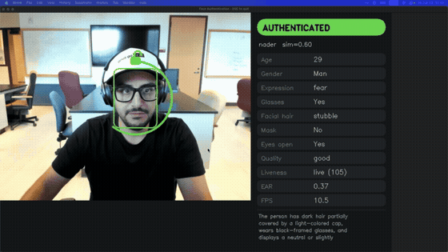
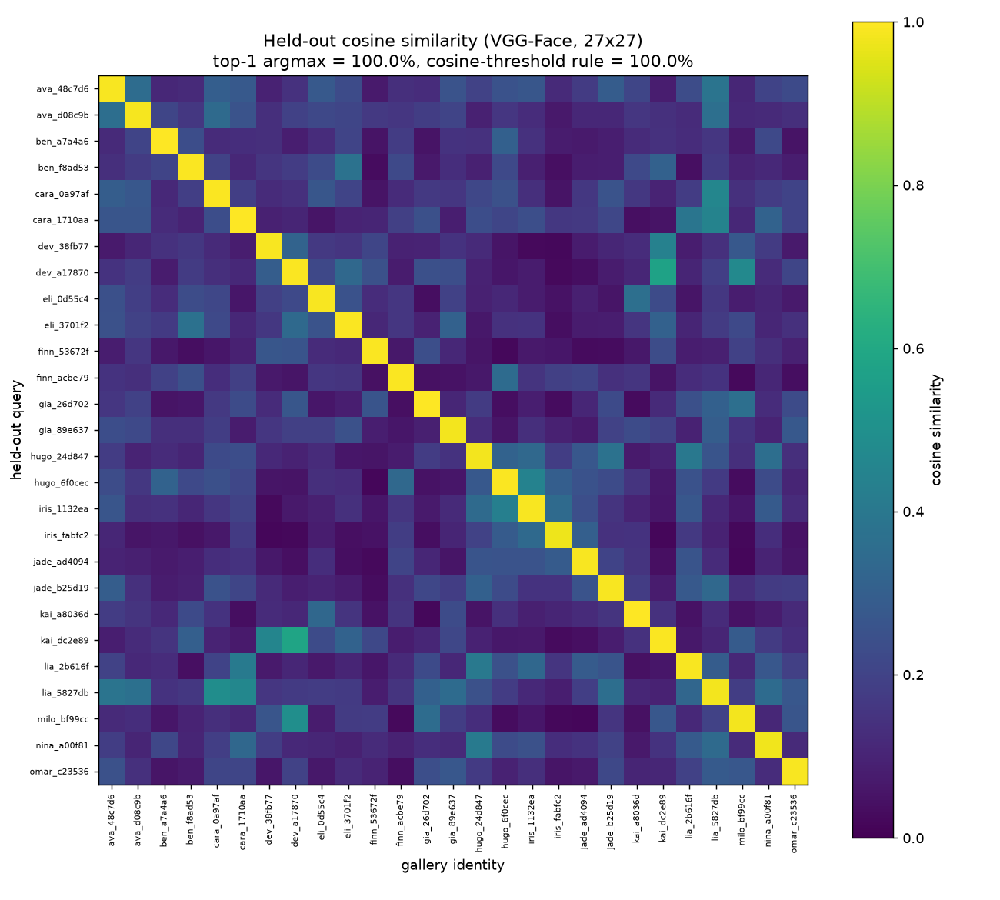
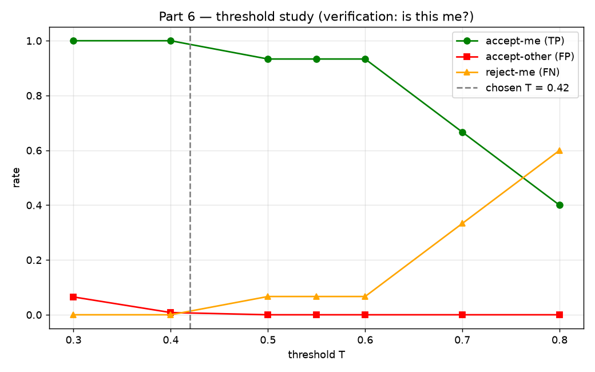
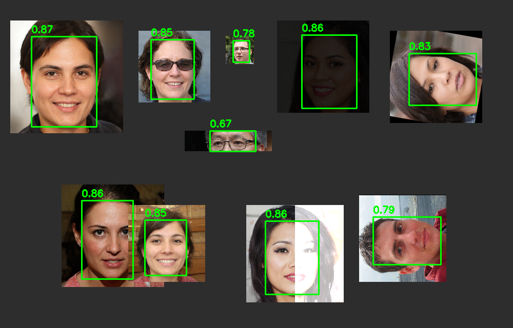
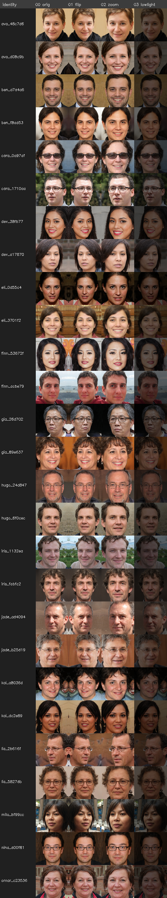

# 🛡️ SecureFaceID

### Real-time face recognition and Face ID–style live authentication, with GenAI attribute description and blink-based anti-spoofing.


An end-to-end face authentication system: a webcam feed is detected, embedded, matched against an enrolled gallery, described by a vision-language model, and judged **AUTHENTICATED** or **DENIED** in an animated, Face ID–style GUI. A blink-based liveness layer defeats printed-photo spoofing.

```
Webcam → YOLO detect → deep embedding (VGG-Face) → cosine match
       → GenAI attributes → decision → Face ID-style GUI
                              ↑ blink / EAR liveness gate
```

## 🎬 Demo



*Live authentication running in real time, with the side panel showing identity, similarity, attributes, and liveness. Full-length recording: [`GUI_Demo.mp4`](GUI_Demo.mp4).*

## ✨ Features

- **Real-time detection** with a YOLOv8-face model (also yields 5 facial keypoints).
- **Deep face embeddings** (DeepFace) with a backbone comparison across **VGG-Face, FaceNet512, and ArcFace**, matched by cosine similarity.
- **Face ID–style GUI** (pure OpenCV): animated scanning ring, a confidence arc, a padlock that morphs locked → unlocked, check/shake feedback, and a dark side panel with rounded attribute cards. Heavy work runs on background threads so the video stays smooth.
- **GenAI attribute description**: a single Claude vision call returns glasses, facial hair, mask, and eyes-open as a structured object, plus a one-sentence rich description. DeepFace adds age, gender, and expression.
- **Blink / EAR anti-spoofing**: MediaPipe FaceLandmarker computes the Eye Aspect Ratio. A printed photo never blinks, so with liveness on it is held at **BLINK NEEDED** and rejected, while the live user passes on a blink.
- **Threshold study**: a verification sweep that picks the operating point with zero false accepts and zero false rejects.

## 📊 Results

| Backbone separation (held-out) | Threshold study |
|---|---|
|  |  |

| Detection on a hard 10-face scene | Synthetic identity database |
|---|---|
|  |  |

The detector found all 10 faces in a deliberately hard composite (tiny, heavily-darkened, 90°-rotated, and ~85%-occluded faces included), and the embedding space cleanly separates distinct identities (bright diagonal, dark off-diagonal).

## 🚀 Quickstart

```bash
# 1. Environment (Python 3.11 recommended for DeepFace/TensorFlow)
python3.11 -m venv .venv && source .venv/bin/activate
pip install -r requirements.txt

# 2. (Optional, for GenAI attributes) add an Anthropic API key
echo "ANTHROPIC_API_KEY=sk-ant-..." > .env

# 3. Build a synthetic identity database (AI-generated faces, no real person)
python code/build_database_download.py --n 12

# 4. Enroll yourself from the webcam (press SPACE x15, ESC to finish)
python code/enroll.py --name me

# 5. Build the embedding database
python code/embed.py

# 6. Run the live authentication app
python code/authenticate.py --me me --threshold 0.42

#    ...with blink-liveness anti-spoofing:
python code/authenticate.py --me me --liveness
```

Model weights are included under `code/models/` (`yolov8n-face.pt`, `face_landmarker.task`). DeepFace backbone weights download automatically on first use.

## 🗂️ Project structure

```
code/
  detect.py                  YOLO face detection (shared)
  embed.py                   embeddings, database build, cosine matching
  describe.py                attributes via DeepFace + Claude vision
  enroll.py                  webcam self-enrollment
  liveness.py                blink / EAR liveness (MediaPipe)
  authenticate.py            live Face ID-style GUI app
  build_database_download.py synthetic face downloader
  part2_demo.py / part3_eval.py / part4_demo.py / part6_threshold_study.py
  models/                    yolov8n-face.pt, face_landmarker.task
```

## 🧰 Tech stack

Python · OpenCV · Ultralytics YOLOv8 · DeepFace (VGG-Face / FaceNet / ArcFace) · scikit-learn · MediaPipe FaceLandmarker · Anthropic Claude (vision) · NumPy · Matplotlib

## ⚖️ Ethics

This is a learning and portfolio project, **not** an access-control product. It has no production-grade liveness defense beyond a simple blink check, face embeddings carry known demographic bias, and biometric data cannot be reset if leaked. All non-self identities are AI-generated synthetic faces (no real person depicted). Do not deploy face authentication without liveness/anti-spoofing, bias auditing, encryption, consent, and legal review.

## 📄 License

MIT — see [LICENSE](LICENSE).
